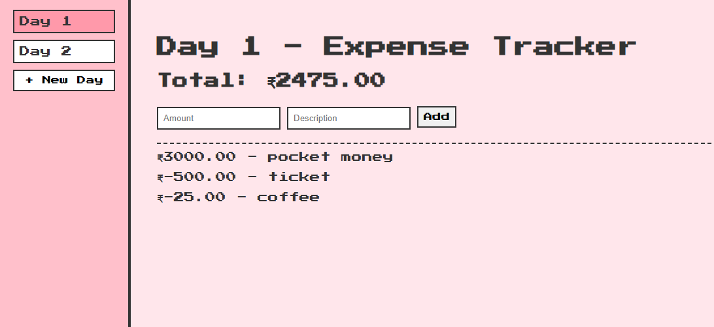

# Day 07 - Expense Tracker (Pixel Theme)

## Project Description
A simple **Expense Tracker** built using **React** and **Vite**, styled with CSS for a playful pixel aesthetic.
This project allows users to track income and expenses on a daily basis. Each day can be started or ended, with previous days' data remaining accessible.

---

## Features
- Add income and expense transactions
- View running total of balance
- Separate daily tracking
- Start new day, view past days
- Simple UI with clear, retro pixel design

---

## Tech Stack
- React
- Vite
- CSS

---

## Preview
