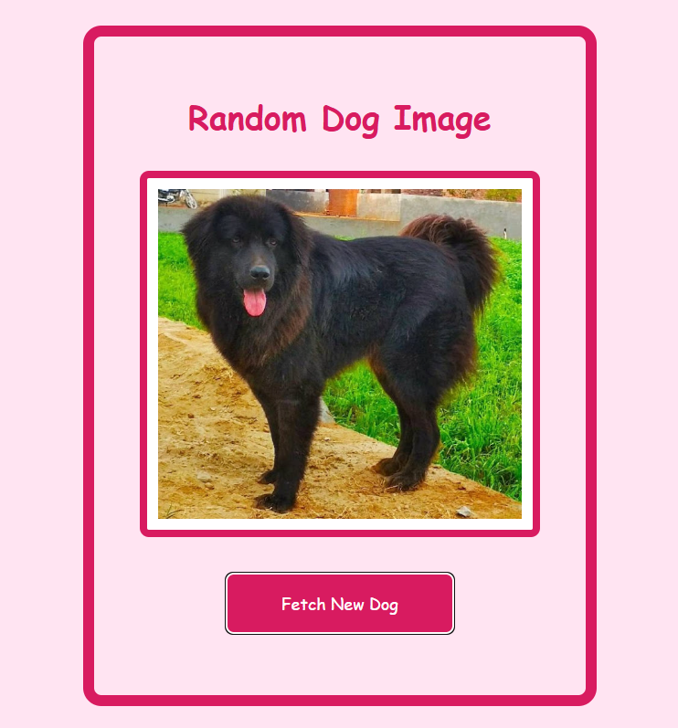

# Day 09 - Random Dog Image Fetcher

---

## Overview
A simple React project that fetches and displays random dog images using the Dog CEO API. Clicking the button retrieves a new random dog photo. The app demonstrates the use of `fetch`, `useState`, and `useEffect` in React.

---

## Features
- Fetches random dog images from the Dog CEO API
- Re-fetches on button click
- Clean, responsive, centered UI
- Large typography and visuals for better readability

---

## Technologies Used
- React (Vite)
- CSS (Custom styling)
- Fetch API

---

## Preview
