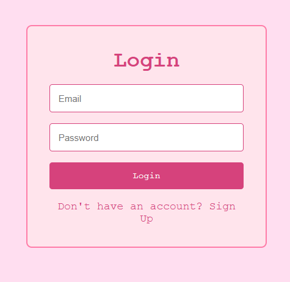
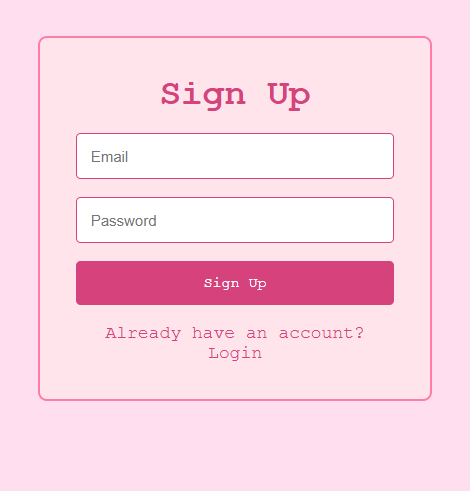

# Day 13 - React Login/Signup Page

## Description
A simple and clean Login / Signup page created using React. This project demonstrates handling user inputs, conditional rendering, and toggling between Login and Signup forms. The design follows a minimal pixel-inspired pink theme and ensures the form is centered on the page.

## Features
- Toggle between Login and Signup forms
- Clean and responsive layout
- Fully centered form on the viewport
- Styled using CSS with a soft pink theme

## Technologies Used
- React
- Vite
- CSS (Flexbox)
- useState Hook

## Preview

